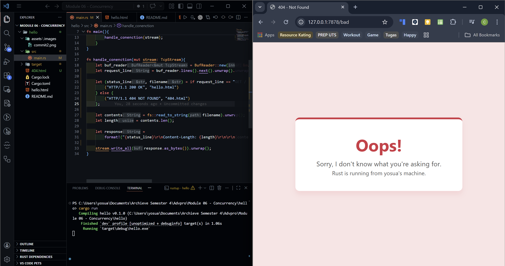

#### Commit 1 Reflection Notes 🛜

Pada tahap ini, saya telah mempelajari bagaimana `TcpListener` bekerja untuk mendengarkan koneksi masuk pada port TCP tertentu. Saya juga menyadari bahwa membaca data dari *stream* jaringan membutuhkan penanganan *buffer* yang baik, di mana `BufReader` sangat membantu pengumpulan teks *request* HTTP baris demi baris. Tanpa *buffer*, saya harus membaca *byte* per *byte* secara manual yang tentunya rentan terhadap *error* dan tidak efisien. Ketika program dijalankan dan saya melakukan *request*, terlihat jelas bagaimana struktur HTTP *request* sebenarnya di balik layar. Pengujian program secara langsung di *environment* Ubuntu Linux ini juga memberikan wawasan tambahan mengenai alokasi dan eksekusi *binding* port oleh sistem operasi. Secara keseluruhan, pemahaman ini memberikan gambaran fundamental yang kuat sebelum beralih menggunakan *framework* web yang lebih kompleks di masa depan.

##### Commit 2 Reflection Notes 🖼️

Pada tahap ini, saya memodifikasi server agar dapat mengembalikan respons berupa dokumen HTML statis. Mengembalikan file HTML ini memberikan saya wawasan baru tentang bagaimana struktur respons HTTP dirakit secara manual dari nol. Saya belajar bahwa penambahan baris *header* `Content-Length` sangat krusial agar browser klien mengetahui dengan pasti berapa banyak *byte* data yang akan ia terima. Membaca file menggunakan fungsi `fs::read_to_string` juga menunjukkan betapa ringkasnya standar *library* Rust dalam menangani operasi pembacaan berkas. Kalkulasi ukuran *string* respons secara dinamis ini sangat membantu mencegah pesan terpotong apabila isi HTML diubah suatu saat nanti. Visualisasi halaman web estetik yang sukses dimuat di browser membuktikan bahwa server TCP sederhana ini sudah mulai berfungsi selayaknya *web server* sungguhan.

#### Commit 3 Reflection Notes 🔀

Pemisahan logika respons berdasarkan *path* URL (*routing*) adalah langkah terpenting agar server tidak sekadar merespons semua permintaan dengan halaman yang sama. Melakukan proses *refactoring* pada kode di tahap ini sangat diperlukan untuk mencegah duplikasi kode, terutama karena struktur penyusunan respons HTTP untuk status 200 OK dan 404 NOT FOUND sebagian besarnya sangat mirip. Saya melihat bahwa validasi komparasi pada variabel `request_line` memudahkan kita untuk mengarahkan alur program ke dokumen HTML yang tepat. Proses ini juga mengajarkan saya tentang pentingnya memberikan penanganan *error* yang baik dan ramah antarmuka ketika klien meminta sumber daya yang memang tidak tersedia di server. Pemisahan blok kode yang bersih ini dijamin akan sangat memudahkan pemeliharaan ketika rute URL yang didukung server ke depannya semakin bertambah kompleks.

#### Commit 4 Reflection Notes 🐢

Simulasi interupsi *slow response* dengan menggunakan fungsi `thread::sleep` benar-benar membuka mata saya terhadap kelemahan mendasar dari arsitektur server *single-threaded*. Ketika saya secara bersamaan mencoba mengakses rute `/sleep` dari satu tab dan rute *root* `/` dari tab browser lain, pemuatan pada tab kedua dipaksa harus menunggu selama kurang lebih 10 detik. Hal ini terjadi karena *thread* utama server sedang tertahan (*blocked*) oleh jeda eksekusi di *request* pertama, sehingga sama sekali tidak bisa memproses antrean koneksi masuk lainnya secara paralel. Bayangkan jika skenario pemblokiran ini terjadi di *environment production* di mana satu proses basis data yang berat dapat secara instan melumpuhkan seluruh layanan untuk ribuan pengguna lain. Uji coba sederhana ini menjadi bukti empiris yang kuat mengapa kita harus segera mengimplementasikan *concurrency* atau pemrosesan *multithreading* pada aplikasi *web server* ini.

#### Commit 5 Reflection Notes 🚀

Penerapan struktur `ThreadPool` merupakan sebuah solusi rekayasa yang sangat elegan untuk mengatasi masalah pemblokiran komputasi pada arsitektur *single-threaded*. Alih-alih merespons setiap *request* dengan membuat *thread* baru secara tak terbatas yang dapat memicu memori habis (*resource exhaustion*), *thread pool* mendisiplinkan alokasi proses dengan menetapkan batas kuota *worker*. Setiap kali *server* menerima koneksi masuk, tugas penyelesaian permintaan (*Job*) akan didistribusikan secara sinkron melalui antrean transmisi (*Message Passing*) kepada *worker* yang sedang *idle*. Mekanisme terdistribusi ini menjamin optimalisasi waktu penyajian halaman *web* secara masif karena tugas dieksekusi secara berbarengan (paralel). Bagian yang paling memukau dari pembaruan ini adalah ketatnya penjagaan kompiler Rust saat menangani memori lintas *thread* (*shared state*); penggunaan struktur `Arc<Mutex<T>>` sukses memaksa saya menuliskan aturan kepemilikan dan penguncian variabel agar sistem secara permanen kebal dari ancaman *data race*. Eksperimen ini mengukuhkan keunggulan Rust sebagai bahasa sistem yang sangat solid untuk menangani *concurrency*.

#### Commit Bonus Reflection Notes 🌟

Pada fase optimisasi lanjutan ini, saya merombak metode *constructor* `ThreadPool` yang semula menggunakan desain `new` konvensional menjadi pola fungsi `build`. Perubahan struktural ini bertujuan memberikan jaring pengaman arsitektural yang jauh lebih bijak ketimbang sekadar mematikan program lewat `panic!` apabila kuota *thread* diatur menjadi nol. Fungsi `build` sekarang mengembalikan enumerasi tipe `Result<ThreadPool, PoolCreationError>`, yang secara langsung memaksa kode pemanggilnya (*caller*) menyadari adanya kemungkinan operasi inisialisasi yang terhambat. Teknik devolusi kontrol penanganan *error* semacam ini sangat krusial dalam lingkup pemrograman perangkat lunak *production-grade* karena memungkinkan program melakukan tindakan pemulihan (*graceful degradation*) tanpa membuat *server* mendadak tewas (*crash*). Melalui proses refaktor sederhana ini, saya memetik pelajaran penting bahwa desain *library* yang tangguh adalah desain yang dapat berkomunikasi secara prediktif terkait setiap kegagalan proses.