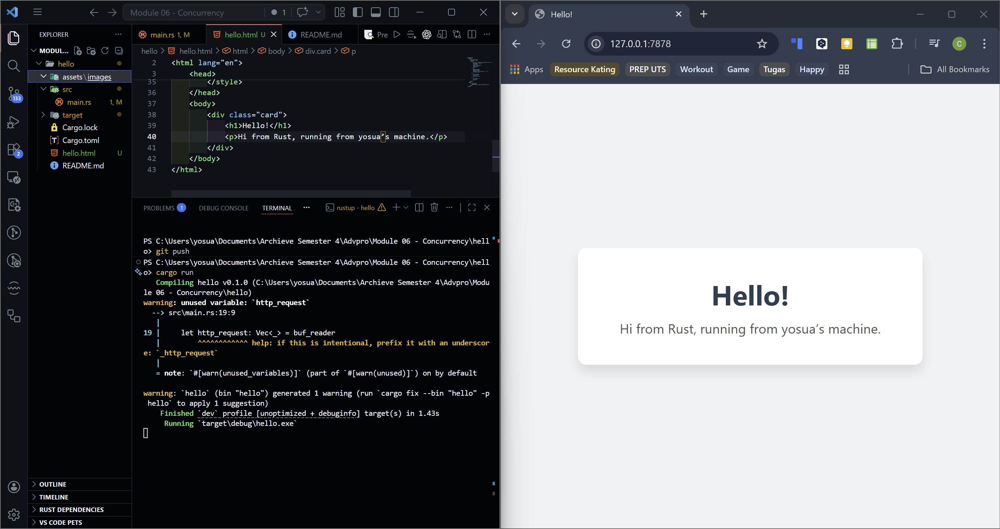

#### Commit 1 Reflection Notes 🛜

Pada tahap ini, saya telah mempelajari bagaimana `TcpListener` bekerja untuk mendengarkan koneksi masuk pada port TCP tertentu. Saya juga menyadari bahwa membaca data dari *stream* jaringan membutuhkan penanganan *buffer* yang baik, di mana `BufReader` sangat membantu pengumpulan teks *request* HTTP baris demi baris. Tanpa *buffer*, saya harus membaca *byte* per *byte* secara manual yang tentunya rentan terhadap *error* dan tidak efisien. Ketika program dijalankan dan saya melakukan *request*, terlihat jelas bagaimana struktur HTTP *request* sebenarnya di balik layar. Pengujian program secara langsung di *environment* Ubuntu Linux ini juga memberikan wawasan tambahan mengenai alokasi dan eksekusi *binding* port oleh sistem operasi. Secara keseluruhan, pemahaman ini memberikan gambaran fundamental yang kuat sebelum beralih menggunakan *framework* web yang lebih kompleks di masa depan.

##### Commit 2 Reflection Notes 🖼️

Pada tahap ini, saya memodifikasi server agar dapat mengembalikan respons berupa dokumen HTML statis. Mengembalikan file HTML ini memberikan saya wawasan baru tentang bagaimana struktur respons HTTP dirakit secara manual dari nol. Saya belajar bahwa penambahan baris *header* `Content-Length` sangat krusial agar browser klien mengetahui dengan pasti berapa banyak *byte* data yang akan ia terima. Membaca file menggunakan fungsi `fs::read_to_string` juga menunjukkan betapa ringkasnya standar *library* Rust dalam menangani operasi pembacaan berkas. Kalkulasi ukuran *string* respons secara dinamis ini sangat membantu mencegah pesan terpotong apabila isi HTML diubah suatu saat nanti. Visualisasi halaman web estetik yang sukses dimuat di browser membuktikan bahwa server TCP sederhana ini sudah mulai berfungsi selayaknya *web server* sungguhan.